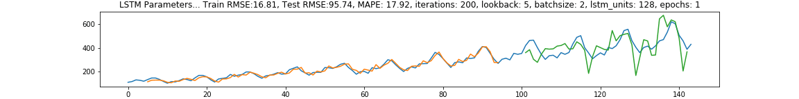

# Introduction to neural networks (Geek University track)

Contains basic concepts, architectures and study cases for Deep learning methods:

#### Iris net. full layered NN on Iris dataset via numpy 
`python Iris_net.ipynb`

#### MNIST classification: full layers, conv and comb parameters via keras
`python MNIST_classifier.ipynb`

#### Simple LSTM parameters dependances
`LSTM_airplane_dataset.ipynb`



#### Convolutional LSTM
`keras_elements.ipynb`
Predicts next frame of an artificially generated movie which contains moving squares
```bibtex
# Artificial data generation:
# Generate movies with 3 to 7 moving squares inside.
# The squares are of shape 1x1 or 2x2 pixels,
# which move linearly over time.
# For convenience we first create movies with bigger width and height (80x80)
# and at the end we select a 40x40 window.
```

