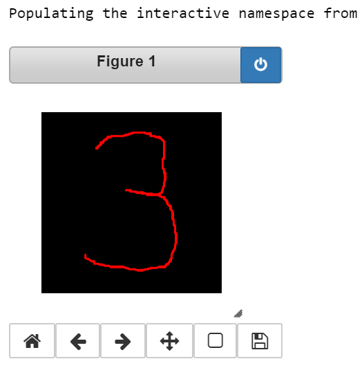
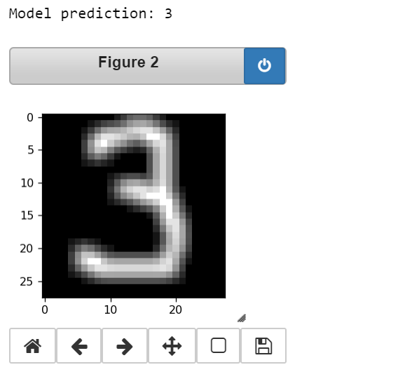

# Introduction to neural networks (Geek University track)

basic concepts, architectures and study cases for Deep learning methods:

### Contents: 

### - [Iris net. full layered NN on Iris dataset via numpy](https://github.com/Nickel-nc/GU_Introduction_To_Neural_Networks/blob/master/FCN%2C%20CNN/Iris_net.ipynb)

### - [MNIST classification: full layers, conv and comb parameters via keras](https://github.com/Nickel-nc/GU_Introduction_To_Neural_Networks/blob/master/FCN%2C%20CNN/MNIST_classifier.ipynb)

, 


### - [Simple LSTM parameters dependances](https://github.com/Nickel-nc/GU_Introduction_To_Neural_Networks/blob/master/LSTM%20models/LSTM_airplane_dataset.ipynb)


### - [Convolutional LSTM](https://github.com/Nickel-nc/GU_Introduction_To_Neural_Networks/blob/master/FCN%2C%20CNN/keras_elements.ipynb)

Predicts next frame of an artificially generated movie which contains moving squares

```bibtex
# Artificial data generation:
# Generate movies with 3 to 7 moving squares inside.
# The squares are of shape 1x1 or 2x2 pixels,
# which move linearly over time.
# For convenience we first create movies with bigger width and height (80x80)
# and at the end we select a 40x40 window.
```


### - [LSTM Text Generation samplesConvolutional LSTM](https://github.com/Nickel-nc/GU_Introduction_To_Neural_Networks/tree/master/LSTM%20models)

## - [Computer vision concepts](https://github.com/Nickel-nc/GU_Introduction_To_Neural_Networks/tree/master/object%20detection%20and%20cv)

### Contents:

### - [GAN tensorflow example](https://github.com/Nickel-nc/GU_Introduction_To_Neural_Networks/blob/master/object%20detection%20and%20cv/GAN%20tf%20example/gan%20example.ipynb)


### - [GAN image generation with MNIST dataset](https://github.com/Nickel-nc/GU_Introduction_To_Neural_Networks/blob/master/object%20detection%20and%20cv/GAN%20MNIST%20image%20generator/GAN%20Image%20generator.ipynb)


