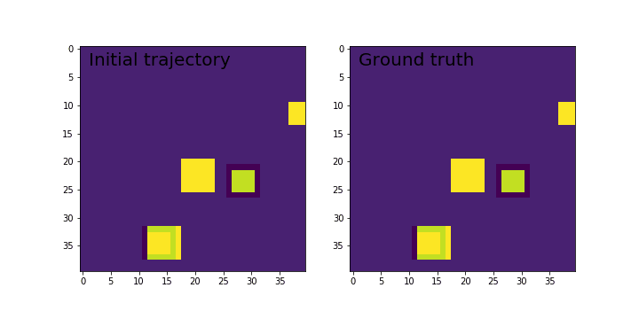

# Introduction to neural networks (Geek University track)

Contains basic concept for DL methods wiht examples

1. Iris net. full layered NN on Iris dataset via numpy

```bibtex
python Iris_net.ipynb
```
2. MNIST classification: full layers, conv and comb parameters via keras

Also contains convolutional LSTM example to predict the next frame of an artificially generated movie which contains moving squares
```bibtex
# Artificial data generation:
# Generate movies with 3 to 7 moving squares inside.
# The squares are of shape 1x1 or 2x2 pixels,
# which move linearly over time.
# For convenience we first create movies with bigger width and height (80x80)
# and at the end we select a 40x40 window.
```


```bibtex
python MNIST_classifier.ipynb
```


